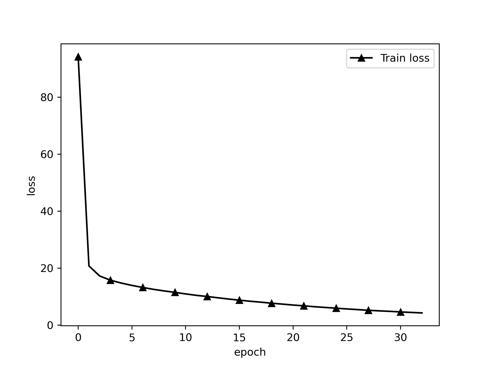
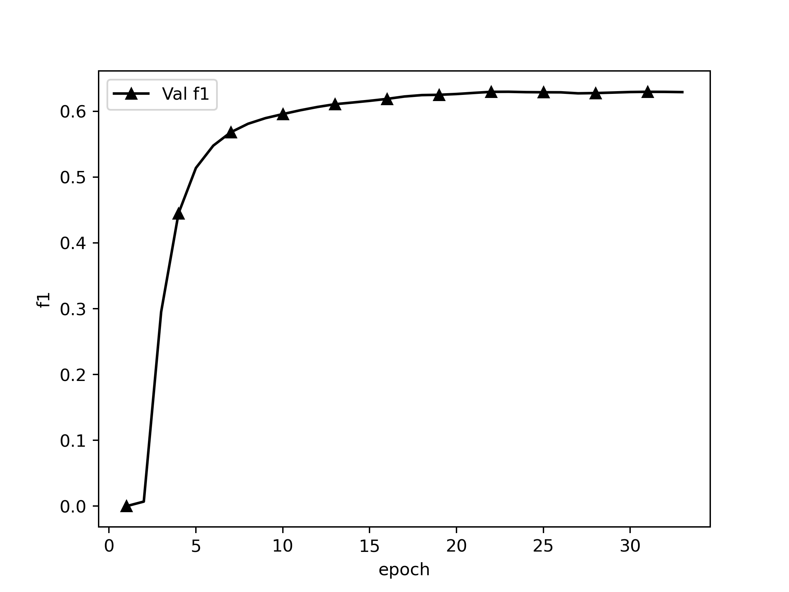

# CHIP-2020 中文医学文本实体关系抽取

## Dataset

CHIP-2020-2中文医学文本实体关系抽取数据集，数据集包含儿科训练语料和百种常见疾病训练语料，儿科训练语料来源于518种儿科疾病，百种常见疾病训练语料来源于109种常见疾病。近7.5万三元组数据，2.8万疾病语句和53种定义好的schema。

同时相比于医学教材，临床实践文本指代关系明显，往往一段话中不会直接提及该主题疾病，因此针对临床实践类语料进行预处理，设计规则在每句之前增加主题疾病实体，并以@和原文分割。抽取语料时，如果三元组来源于上下多个句子，此时将句子进行拼接，”spo_list”中的Combined字段记录拼接信息。若句子中存在多个三元组，则记录在”spo_list”字段中，”text”字段记录来源文本。

数据原始格式形如：

### 数据集格式

```
{
   "spo_list" : [
      {
         "Combined" : true,
         "object" : {
            "@value" : "外照射"
         },
         "object_type" : {
            "@value" : "其他治疗"
         },
         "predicate" : "放射治疗",
         "subject" : "慢性胰腺炎",
         "subject_type" : "疾病"
      },
      {
         "Combined" : true,
         "object" : {
            "@value" : "外照射"
         },
         "object_type" : {
            "@value" : "其他治疗"
         },
         "predicate" : "放射治疗",
         "subject" : "非肿瘤性疼痛",
         "subject_type" : "疾病"
      }
   ],
   "text" : "慢性胰腺炎@### 低剂量放射 自1964年起，有几项病例系列报道称外照射 (5-50Gy) 可以有效改善慢性胰腺炎患者的疼痛症状。慢性胰腺炎@从概念上讲，外照射可以起到抗炎和止痛作用，并且已经开始被用于非肿瘤性疼痛的治疗。"
}
```

本代码需要将数据处理成如下的格式：

```
{
   "spo_list" : [
      {
         "Combined" : true,
         "object" : "外照射",
         "object_type" : "其他治疗",
         "predicate" : "放射治疗",
         "subject" : "慢性胰腺炎",
         "subject_type" : "疾病"
      },
      {
         "Combined" : true,
         "object" : "外照射",
         "object_type" : "其他治疗",
         "predicate" : "放射治疗",
         "subject" : "非肿瘤性疼痛",
         "subject_type" : "疾病"
      }
   ],
   "text" : "慢性胰腺炎@### 低剂量放射 自1964年起，有几项病例系列报道称外照射 (5-50Gy) 可以有效改善慢性胰腺炎患者的疼痛症状。慢性胰腺炎@从概念上讲，外照射可以起到抗炎和止痛作用，并且已经开始被用于非肿瘤性疼痛的治疗。"
}
```

### schemas格式

数据集中schemas的原始格式如下：


schemas需被处理成如下格式：

```
... ...

{"subject_type": "疾病", "predicate": "发病部位", "object_type": "部位"}
{"subject_type": "疾病", "predicate": "转移部位", "object_type": "部位"}
{"subject_type": "疾病", "predicate": "外侵部位", "object_type": "部位"}

... ...

```

### dataloader单条格式

`{'text': text, 'spo_list': [(s, p, o)]}`

ATTENTION:

- **`schema`中的`predicate`不能重复，如有重复要更改，加以区别，否则就算`object_type`和`subject_type`不一致，只要`predicate`一致，就认为是一个关系。数据里的`predicate`也要同步更改。**

## Project Structure

```
./
├── README.md
├── chinese_roformer-v2-char_L-12_H-768_A-12            roformer-v2 12层base版
│		 ├── bert_config.json
│		 ├── bert_model.ckpt.data-00000-of-00001
│		 ├── bert_model.ckpt.index
│		 ├── bert_model.ckpt.meta
│		 ├── checkpoint
│		 └── vocab.txt
├── chinese_roformer-v2-char_L-6_H-384_A-6              roformer-v2 12层base版
│		 ├── bert_config.json
│		 ├── bert_model.ckpt.data-00000-of-00001
│		 ├── bert_model.ckpt.index
│		 ├── bert_model.ckpt.meta
│		 ├── checkpoint
│		 └── vocab.txt
├── config.py                                           部分超参数配置
├── data
│		 ├── chip2020                           数据集
│		 │		 ├── 53_schemas.json
│		 │		 ├── train_data.json
│		 │		 └── val_data.json
│		 └── pred                               最佳模型预测样本
│		     ├── val_pred_ep38.json
│		     └── val_pred_ep73.json
├── dataloader.py                                       数据编码器
├── evaluate.py                                         模型评估
├── images                                              数据绘图
│		 ├── train_loss.png
│		 ├── train_loss_base.png
│		 ├── val_f1.png
│		 └── val_f1_base.png
├── log                                                 日志
│		 ├── f1.out
│		 ├── nohup.out
│		 ├── nohup_base.out
│		 ├── train_log.csv
│		 └── train_log_base.csv
├── main.py
├── model.py                                            模型文件
├── path.py                                             项目路径
├── plot.py                                             画图工具
├── predict.py                                          预测文件
├── report                                              模型评估报告
│		 ├── f1.csv
│		 ├── predicate_f1.csv
│		 └── predicate_f1_base.csv
├── schemaloader.py                                     schema加载器
├── test.py                                             token转可读字符
├── train.py                                            训练
├── utils                                               bert4keras工具包，可pip下载
│		 ├── __init__.py
│		 ├── adversarial.py
│		 ├── backend.py
│		 ├── layers.py
│		 ├── models.py
│		 ├── optimizers.py
│		 ├── snippets.py
│		 └── tokenizers.py
└── weights                                             保存的权重
    ├── gplinker_roformer_best.h5
    └── gplinker_roformer_v2_best.h5

10 directories, 51 files

```

## Requirements

```
Keras==2.2.4
matplotlib==3.4.0
pandas==1.2.3
pydot==1.4.1
tensorflow==1.14.0
tqdm==4.61.2
```

## Steps

1. 将数据转换成规定格式
2. 修改path.py中的地址
3. 根据需要修改model.py模型结构
4. 调整超参数
5. fit前debug
6. 训练

## Model

### 预训练模型

> RoFormer-v2 base版，是SimBERT模型的升级版。
> 
> [https://github.com/ZhuiyiTechnology/roformer-sim](https://github.com/ZhuiyiTechnology/roformer-sim)
> 
> 基于UniLM思想、融检索与生成于一体的BERT模型。
> 
> 权重下载：[https://github.com/ZhuiyiTechnology/pretrained-models](https://github.com/ZhuiyiTechnology/pretrained-models)

### 三元组抽取下游模型

> [GlobalPointer：用统一的方式处理嵌套和非嵌套NER](https://spaces.ac.cn/archives/8373)
> 
> [Efficient GlobalPointer：少点参数，多点效果](https://spaces.ac.cn/archives/8877)
> 
> [GPLinker：基于GlobalPointer的实体关系联合抽取](https://spaces.ac.cn/archives/8888)

gplinker的标签loader有3个：`batch_entity_labels`、`batch_head_labels`、`batch_tail_labels`。

- `batch_entity_labels`为实体指针，实体头指向实体，维度（batch_size, 2, batch内最大单条object数, 2），其中第二维包括subject和object指针，subject和object指针的第三维数量都要填充到batch内最大单条object数。第四维是头指针和尾指针，第一个是实体头在tokens中的下标，第二个是实体尾在tokens中的下标。`batch_entity_labels`的GlobalPointer中需要mask掉下三角，因为实体头不可能出现在实体为后面。
- `batch_head_labels`为头对头指针，subject头指向object头，维度（batch_size, predicate数量, batch内最大单条头对头指针数, 2）。第四维是头对头指针，第一个是subject实体头在tokens中的下标，第二个是object实体头在tokens中的下标。`batch_entity_labels`的GlobalPointer中不能mask掉下三角，因为subject头可能在object头后面。
- `batch_tail_labels`为头对头指针，subject尾指向object尾，维度（batch_size, predicate数量, batch内最大单条尾对尾指针数, 2）。第四维是尾对尾指针，第一个是subject实体尾在tokens中的下标，第二个是object实体尾在tokens中的下标。`batch_entity_labels`的GlobalPointer中不能mask掉下三角，因为subject尾可能在object头后面。需要该指针的意义是为了能有效识别出嵌套关系（头指针相同、尾指针不同的关系）。

## Config

- `maxlen` 训练中每个batch的最大单句长度，少于填充，多于截断
- `epochs` 最大训练轮次
- `batch_size` batch size
- `model_type` 模型， 'roformer_v2'

### 优化策略

- 使用EMA(exponential mobing average)滑动平均配合Adam作为优化策略。滑动平均可以用来估计变量的局部值，是的变量的更新与一段时间内的历史值有关。它的意义在于利用滑动平均的参数来提高模型在测试数据上的健壮性。
  EMA 对每一个待更新训练学习的变量 (variable) 都会维护一个影子变量 (shadow variable)。影子变量的初始值就是这个变量的初始值。
- BERT模型由于已经有了预训练权重，所以微调权重只需要很小的学习率，而LSTM和GlobalPointer层使用的`he_normal`初始化学习率，需要使用较大学习率，所以本模型使用[分层学习率](https://kexue.fm/archives/6418)
- 在Embedding层注入扰动，[启用FGM对抗训练](https://kexue.fm/archives/7234) ，使模型更具鲁棒性，也可以一定程度避免过拟合。

## Train

```
Epoch 1/999
2022-04-09 12:27:29.059157: I tensorflow/stream_executor/platform/default/dso_loader.cc:42] Successfully opened dynamic library libcublas.so.10.0
449/449 [==============================] - 609s 1s/step - loss: 91.8303 - global_pointer_1_loss: 10.6130 - global_pointer_2_loss: 42.6791 - global_pointer_3_loss: 38.5381
f1: 0.00000, precision: 1.00000, recall: 0.00000: : 3585it [01:36, 37.31it/s]
best f1: 0.00000
Epoch 2/999
449/449 [==============================] - 599s 1s/step - loss: 20.8080 - global_pointer_1_loss: 4.7649 - global_pointer_2_loss: 8.1455 - global_pointer_3_loss: 7.8975
f1: 0.00376, precision: 0.95238, recall: 0.00188: : 3585it [01:28, 40.33it/s]
best f1: 0.00376
Epoch 3/999
449/449 [==============================] - 595s 1s/step - loss: 17.3179 - global_pointer_1_loss: 4.2940 - global_pointer_2_loss: 6.5926 - global_pointer_3_loss: 6.4313
f1: 0.28070, precision: 0.81374, recall: 0.16960: : 3585it [01:32, 38.90it/s]
best f1: 0.28070

... ...

Epoch 41/999
449/449 [==============================] - 599s 1s/step - loss: 3.1723 - global_pointer_1_loss: 0.8681 - global_pointer_2_loss: 1.1746 - global_pointer_3_loss: 1.1296
f1: 0.63549, precision: 0.66464, recall: 0.60878: : 3585it [01:29, 39.87it/s]
Early stop count 3/5
best f1: 0.63722
Epoch 42/999
449/449 [==============================] - 600s 1s/step - loss: 3.0286 - global_pointer_1_loss: 0.8214 - global_pointer_2_loss: 1.1189 - global_pointer_3_loss: 1.0884
f1: 0.63644, precision: 0.66639, recall: 0.60906: : 3585it [01:30, 39.65it/s]
Early stop count 4/5
best f1: 0.63722
Epoch 43/999
449/449 [==============================] - 600s 1s/step - loss: 3.0129 - global_pointer_1_loss: 0.8265 - global_pointer_2_loss: 1.1001 - global_pointer_3_loss: 1.0864
f1: 0.63660, precision: 0.66595, recall: 0.60972: : 3585it [01:33, 38.21it/s]
Early stop count 5/5
Epoch 00042: early stopping THR
best f1: 0.63722
```

训练loss



预测时将生成验证集验证结果，在`data/pred/val_pred_ep{}.json`中。格式形如：

```json
{
    "text": "缺血性卒中@一些专门的卒中治疗中心使用MRI取代CT作为初始的首选影像学检查。",
    "spo_list": [
        [
            "缺血性卒中",
            "影像学检查",
            "MRI"
        ]
    ],
    "spo_list_pred": [
        [
            "缺血性卒中",
            "影像学检查",
            "MRI取代CT"
        ],
        [
            "缺血性卒中",
            "影像学检查",
            "MRI"
        ]
    ],
    "new": [
        [
            "缺血性卒中",
            "影像学检查",
            "MRI取代CT"
        ]
    ],
    "lack": []
}
```

其中，new为`spo_list_pred`中比`spo_list`中多出的关系/实体，lack为`spo_list_pred`中比`spo_list`中少的关系/实体

## Evaluate

在训练过程中使用Keras的Callback进行评估，评估策略为计算F1值，只有subject、predicate、object三者完全一致才算True。

根据总的F1来决定什么时候停止训练。即所有的predicate类别一起统计，TP为所有subject、predicate、object都正确的个数，TP+FP为预测实体总数，TP+FN为真实实体总数。

停止条件：当验证集F1超过5轮没有上升时，停止训练。

### 评估每个关系类别的F1

训练完成后选择最佳模型，直接运行`evaluate.py`

```python
result = evaluate_each_relations_f1(model_path = "./weights/gplinker_roformer_best.h5",
                                    dataset_path = "./data/chip2020/val_data.json")
df = pd.DataFrame(result)
df = df.T
df[["TP", "TP+FP", "TP+FN"]] = df[["TP", "TP+FP", "TP+FN"]].astype(int)
print(df)
```

- `model_path`: 模型地址
- `dataset_path`: 数据集地址

## Performance

### 验证集F1表现



### 验证集最佳F1

```
Epoch 38/999
449/449 [==============================] - 602s 1s/step - loss: 3.5846 - global_pointer_1_loss: 0.9795 - global_pointer_2_loss: 1.3256 - global_pointer_3_loss: 1.2795
f1: 0.63722, precision: 0.66653, recall: 0.61038: : 3585it [01:31, 39.13it/s]
best f1: 0.63722
```

### 最佳模型每个关系的F1

```
Evaluating F1 of each Categories: 100%|███████████████████████| 3585/3585 [1:00:05<00:00,  1.01s/it]
                  TP  TP+FP  TP+FN  precision  recall      f1
预防                37     78     78     0.4744  0.4744  0.4744
阶段                29     33     44     0.8788  0.6591  0.7532
就诊科室               3      5      4     0.6000  0.7500  0.6667
同义词（其他/其他）         0      0      0     1.0000  1.0000  1.0000
辅助治疗             200    339    382     0.5900  0.5236  0.5548
化疗                19     32     34     0.5938  0.5588  0.5758
放射治疗              14     26     30     0.5385  0.4667  0.5000
同义词（其他治疗/其他治疗）     5     12     10     0.4167  0.5000  0.4545
手术治疗              98    171    196     0.5731  0.5000  0.5341
同义词（手术治疗/手术治疗）     2      6      2     0.3333  1.0000  0.5000
实验室检查            284    464    447     0.6121  0.6353  0.6235
影像学检查            201    323    317     0.6223  0.6341  0.6281
辅助检查              49    112    130     0.4375  0.3769  0.4050
组织学检查             47     74     91     0.6351  0.5165  0.5697
同义词（检查/检查）        39     58     69     0.6724  0.5652  0.6142
内窥镜检查             22     35     41     0.6286  0.5366  0.5789
筛查                 7      9     37     0.7778  0.1892  0.3043
多发群体              97    128    145     0.7578  0.6690  0.7106
发病率               52     93     86     0.5591  0.6047  0.5810
发病年龄              39     54     58     0.7222  0.6724  0.6964
多发地区              28     32     35     0.8750  0.8000  0.8358
发病性别倾向            19     29     35     0.6552  0.5429  0.5938
死亡率               12     19     16     0.6316  0.7500  0.6857
多发季节              13     18     15     0.7222  0.8667  0.7879
传播途径               2      6     12     0.3333  0.1667  0.2222
同义词（流行病学/流行病学）     0      0      2     1.0000  0.0000  0.0000
同义词（疾病/疾病）       476    590    582     0.8068  0.8179  0.8123
并发症              299    472    540     0.6335  0.5537  0.5909
病理分型             272    396    497     0.6869  0.5473  0.6092
相关（导致）            88    166    315     0.5301  0.2794  0.3659
鉴别诊断             210    265    290     0.7925  0.7241  0.7568
相关（转化）            34     61    165     0.5574  0.2061  0.3009
相关（症状）            26     36     74     0.7222  0.3514  0.4727
临床表现            2064   3017   3001     0.6841  0.6878  0.6859
治疗后症状              8     10     25     0.8000  0.3200  0.4571
侵及周围组织转移的症状        0      0     12     1.0000  0.0000  0.0000
同义词（症状/症状）         0      0      7     1.0000  0.0000  0.0000
病因               431    691    737     0.6237  0.5848  0.6036
高危因素             155    238    272     0.6513  0.5699  0.6078
风险评估因素            24     45    122     0.5333  0.1967  0.2874
病史                16     26     36     0.6154  0.4444  0.5161
遗传因素              13     19     23     0.6842  0.5652  0.6190
同义词（社会学/社会学）      14     53     36     0.2642  0.3889  0.3146
发病机制               1      1      6     1.0000  0.1667  0.2857
病理生理               4      5     12     0.8000  0.3333  0.4706
药物治疗             732   1057   1043     0.6925  0.7018  0.6971
同义词（药物/药物）        26     53     39     0.4906  0.6667  0.5652
发病部位             204    272    304     0.7500  0.6711  0.7083
转移部位              15     28     49     0.5357  0.3061  0.3896
外侵部位               8     10     31     0.8000  0.2581  0.3902
同义词（部位/部位）         0      0      1     1.0000  0.0000  0.0000
预后状况              11     29     47     0.3793  0.2340  0.2895
预后生存率             20     23     31     0.8696  0.6452  0.7407
```

## Predict

```python
text = "妊娠胆汁淤积@[HELLP 综合征] ### 急性妊娠期脂肪肝 体征/症状 检查 体征/症状 患者感觉不适，常见表现为全身乏力、恶心，很多具有先兆子痫、凝血功能异常和肾脏损伤的典型症状。妊娠胆汁淤积@肝脏活检见脂肪浸润，但一般诊断过程中极少进行活检。妊娠胆汁淤积@[HELLP 综合征] ### 急性妊娠期脂肪肝 体征/症状 检查 体征/症状 患者感觉不适，常见表现为全身乏力、恶心，很多具有先兆子痫、凝血功能异常和肾脏损伤的典型症状。妊娠胆汁淤积@肝脏活检见脂肪浸润，但一般诊断过程中极少进行活检。"
print(json.dumps(predict(text = text,
                         model_path = "./weights/gplinker_roformer_v2_best.h5"), ensure_ascii = False))
```

`text`为输入文本，`model_path`为使用权重的路径

输出结果

```json
{
   "spo_list" : [
      {
         "object" : "维生素B12和（或）叶酸缺乏",
         "object_type" : "社会学",
         "predicate" : "病因",
         "subject" : "营养性巨幼细胞性贫血",
         "subject_type" : "疾病"
      },
      {
         "object" : "亚叶酸钙",
         "object_type" : "药物",
         "predicate" : "药物治疗",
         "subject" : "营养性巨幼细胞性贫血",
         "subject_type" : "疾病"
      },
      {
         "object" : "calc leucovorin",
         "object_type" : "药物",
         "predicate" : "同义词（药物/药物）",
         "subject" : "亚叶酸钙",
         "subject_type" : "药物"
      },
      {
         "object" : "抗叶酸代谢药物",
         "object_type" : "社会学",
         "predicate" : "病因",
         "subject" : "营养性巨幼细胞性贫血",
         "subject_type" : "疾病"
      },
      {
         "object" : "nutritional megaloblastic anemia",
         "object_type" : "疾病",
         "predicate" : "同义词（疾病/疾病）",
         "subject" : "营养性巨幼细胞性贫血",
         "subject_type" : "疾病"
      }
   ],
   "standarlization_list" : [
      {
         "attributes" : {
            "同义词（疾病/疾病）" : [ "nutritional megaloblastic anemia" ],
            "病因" : [ "维生素B12和（或）叶酸缺乏", "抗叶酸代谢药物" ],
            "药物治疗" : [ "亚叶酸钙" ]
         },
         "subject" : "营养性巨幼细胞性贫血"
      },
      {
         "attributes" : {
            "同义词（药物/药物）" : [ "calc leucovorin" ]
         },
         "subject" : "亚叶酸钙"
      }
   ],
   "text" : "营养性巨幼细胞性贫血（nutritional megaloblastic anemia)是由于维生素B12和（或）叶酸缺乏所致的一种大细胞性贫血。因使用抗叶酸代谢药物而致病者，可用亚叶酸钙（calc leucovorin)治疗。"
}
```

其中：

- `spo_list`为原始格式，抽出每个关系的列表
- `standarlization_list`为根据`spo_list`的父子关系结构化而成的json，subjects为父节点，objects为`attributes`列表里每个的value，objects_type为key

## 训练配置

```
                 ..                    bureaux@localhost.localdomain
               .PLTJ.                  -----------------------------
              <><><><>                 OS: CentOS Linux 7 (Core) x86_64
     KKSSV' 4KKK LJ KKKL.'VSSKK        Host: 2288 V5 Purley
     KKV' 4KKKKK LJ KKKKAL 'VKK        Kernel: 3.10.0-957.el7.x86_64
     V' ' 'VKKKK LJ KKKKV' ' 'V        Uptime: 117 days, 9 hours, 14 mins
     .4MA.' 'VKK LJ KKV' '.4Mb.        Packages: 1550 (rpm)
   . KKKKKA.' 'V LJ V' '.4KKKKK .      Shell: zsh 5.0.2
 .4D KKKKKKKA.'' LJ ''.4KKKKKKK FA.    Terminal: /dev/pts/1
<QDD ++++++++++++  ++++++++++++ GFD>   CPU: Intel Xeon Silver 4214R (48) @ 2.401GHz
 'VD KKKKKKKK'.. LJ ..'KKKKKKKK FV     GPU: Intelligent Management system chip w/VGA support]
   ' VKKKKK'. .4 LJ K. .'KKKKKV '      GPU: NVIDIA 3b:00.0 NVIDIA Corporation Device 1df6
      'VK'. .4KK LJ KKA. .'KV'         Memory: 80216MiB / 128273MiB
     A. . .4KKKK LJ KKKKA. . .4
     KKA. 'KKKKK LJ KKKKK' .4KK
     KKSSA. VKKK LJ KKKV .4SSKK
              <><><><>
               'MKKM'
                 ''
```