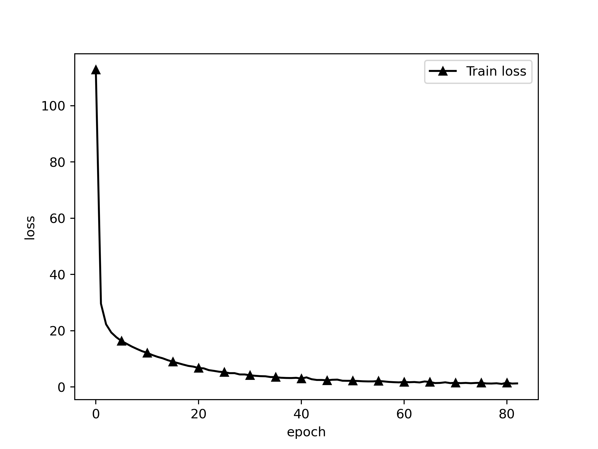
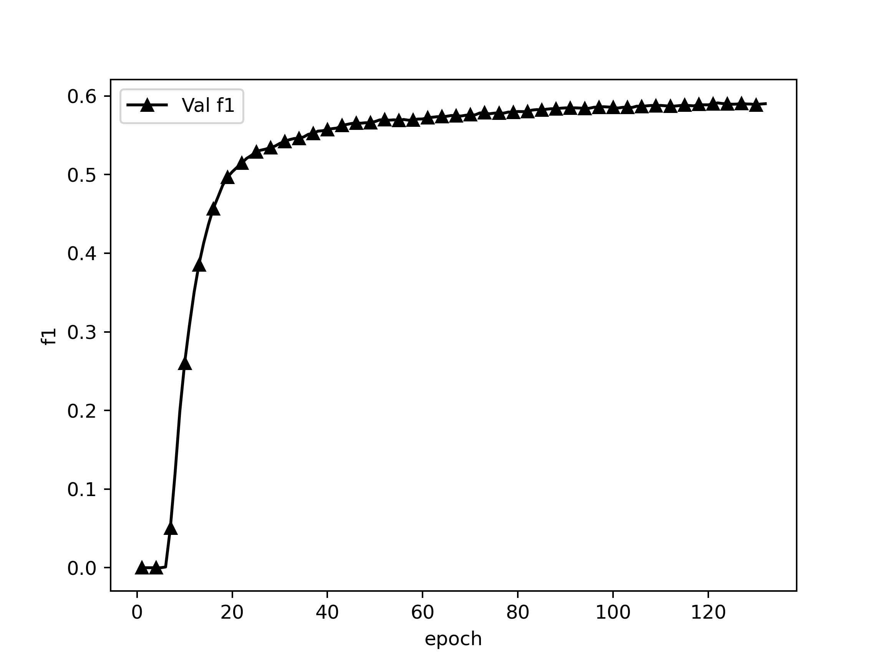

# CHIP-2020 中文医学文本实体关系抽取

## Dataset

CHIP-2020-2中文医学文本实体关系抽取数据集，数据集包含儿科训练语料和百种常见疾病训练语料，儿科训练语料来源于518种儿科疾病，百种常见疾病训练语料来源于109种常见疾病。近7.5万三元组数据，2.8万疾病语句和53种定义好的schema。

同时相比于医学教材，临床实践文本指代关系明显，往往一段话中不会直接提及该主题疾病，因此针对临床实践类语料进行预处理，设计规则在每句之前增加主题疾病实体，并以@和原文分割。抽取语料时，如果三元组来源于上下多个句子，此时将句子进行拼接，”spo_list”中的Combined字段记录拼接信息。若句子中存在多个三元组，则记录在”spo_list”字段中，”text”字段记录来源文本。

数据原始格式形如：

### 数据集格式

```
{
   "spo_list" : [
      {
         "Combined" : true,
         "object" : {
            "@value" : "外照射"
         },
         "object_type" : {
            "@value" : "其他治疗"
         },
         "predicate" : "放射治疗",
         "subject" : "慢性胰腺炎",
         "subject_type" : "疾病"
      },
      {
         "Combined" : true,
         "object" : {
            "@value" : "外照射"
         },
         "object_type" : {
            "@value" : "其他治疗"
         },
         "predicate" : "放射治疗",
         "subject" : "非肿瘤性疼痛",
         "subject_type" : "疾病"
      }
   ],
   "text" : "慢性胰腺炎@### 低剂量放射 自1964年起，有几项病例系列报道称外照射 (5-50Gy) 可以有效改善慢性胰腺炎患者的疼痛症状。慢性胰腺炎@从概念上讲，外照射可以起到抗炎和止痛作用，并且已经开始被用于非肿瘤性疼痛的治疗。"
}
```

本代码需要将数据处理成如下的格式：

```
{
   "spo_list" : [
      {
         "Combined" : true,
         "object" : "外照射",
         "object_type" : "其他治疗",
         "predicate" : "放射治疗",
         "subject" : "慢性胰腺炎",
         "subject_type" : "疾病"
      },
      {
         "Combined" : true,
         "object" : "外照射",
         "object_type" : "其他治疗",
         "predicate" : "放射治疗",
         "subject" : "非肿瘤性疼痛",
         "subject_type" : "疾病"
      }
   ],
   "text" : "慢性胰腺炎@### 低剂量放射 自1964年起，有几项病例系列报道称外照射 (5-50Gy) 可以有效改善慢性胰腺炎患者的疼痛症状。慢性胰腺炎@从概念上讲，外照射可以起到抗炎和止痛作用，并且已经开始被用于非肿瘤性疼痛的治疗。"
}
```

### schemas格式

数据集中schemas的原始格式如下：


schemas需被处理成如下格式：

```
... ...

{"subject_type": "疾病", "predicate": "发病部位", "object_type": "部位"}
{"subject_type": "疾病", "predicate": "转移部位", "object_type": "部位"}
{"subject_type": "疾病", "predicate": "外侵部位", "object_type": "部位"}

... ...

```

### dataloader单条格式

`{'text': text, 'spo_list': [(s, p, o)]}`

ATTENTION:

- **`schema`中的`predicate`不能重复，如有重复要更改，加以区别，否则就算`object_type`和`subject_type`不一致，只要`predicate`一致，就认为是一个关系。数据里的`predicate`也要同步更改。**

## Project Structure

```
./
├── README.md
├── casrel.py                              CasRel模型
├── chinese_roformer-sim-char-ft_L-12_H-768_A-12                              786隐藏层base版bert模型
│   ├── bert_config.json
│   ├── bert_model.ckpt.data-00000-of-00001
│   ├── bert_model.ckpt.index
│   ├── bert_model.ckpt.meta
│   ├── checkpoint
│   └── vocab.txt
├── chinese_roformer-sim-char-ft_L-6_H-384_A-6                              384隐藏层base版bert模型
│   ├── bert_config.json
│   ├── bert_model.ckpt.data-00000-of-00001
│   ├── bert_model.ckpt.index
│   ├── bert_model.ckpt.meta
│   ├── checkpoint
│   └── vocab.txt
├── config.py                              模型配置
├── data                                   数据文件夹
│   ├── chip_2020_2                        原始数据
│   │   ├── 53_schemas.json
│   │   ├── train_data.json
│   │   └── val_data.json
│   ├── pred                               评估模型时预测生成的数据
│   │   └── val_pred_ep121.json
│   └── preprocessed                       经过处理后可以用预训练的数据
│       ├── 53_schemas.json
│       ├── train_data.json
│       └── val_data.json
├── dataloader.py                          训练数据生成器
├── evaluate.py                            评估方法
├── images
│   ├── model.png                          模型可视化
│   ├── train_loss.png                     训练损失
│   └── val_f1.png                         验证F1
├── schemaloader.py                        载入schema
├── log
│   ├── nohup.out                          训练日志
│   └── train_log.csv                      训练损失
├── path.py                                项目所有文件的路径
├── plot.py                                画图工具
├── predict.py                             生成预测
├── report
│   └── f1.csv                             验证F1
├── statistics.py                          统计最长句子长度
├── train.py                               训练
├── utils                                  bert4keras工具包，也可pip下载
│   ├── __init__.py
│   ├── adversarial.py
│   ├── backend.py
│   ├── layers.py
│   ├── models.py
│   ├── optimizers.py
│   ├── snippets.py
│   └── tokenizers.py
└── weights                                保存的权重
    └── chip2020_roformer_best.h5

```

## Requirements

```
Keras==2.2.4
matplotlib==3.4.0
pandas==1.2.3
pydot==1.4.1
tensorflow==1.14.0
tqdm==4.61.2
```

## Steps

1. 将数据转换成规定格式
2. 修改path.py中的地址
3. 根据需要修改model.py模型结构
4. 调整超参数
5. fit前debug
6. 训练

## Model

### 预训练模型

> RoFormer-Sim，又称SimBERTv2，是SimBERT模型的升级版。
> 
> [https://github.com/ZhuiyiTechnology/roformer-sim](https://github.com/ZhuiyiTechnology/roformer-sim)
> 
> 基于UniLM思想、融检索与生成于一体的BERT模型。
> 
> 权重下载：[https://github.com/ZhuiyiTechnology/pretrained-models](https://github.com/ZhuiyiTechnology/pretrained-models)

### 三元组抽取下游模型

> [基于DGCNN和概率图的轻量级信息抽取模型](https://kexue.fm/archives/6671)
> 
> [Casrel关系抽取模型](https://kexue.fm/archives/7161)

## Config

- `maxlen` 训练中每个batch的最大单句长度，少于填充，多于截断
- `epochs` 最大训练轮次
- `batch_size` batch size
- `model_type` 模型， 'roformer'

## Train

```
Epoch 1/200
113/113 [==============================] - 107s 948ms/step - loss: 0.4781 - val_loss: 0.2970
f1: 0.00000, precision: 1.00000, recall: 0.00000: : 3585it [00:57, 61.87it/s]
best f1: 0.00000
Epoch 2/200
113/113 [==============================] - 93s 826ms/step - loss: 0.2564 - val_loss: 0.1617
f1: 0.00000, precision: 1.00000, recall: 0.00000: : 3585it [00:56, 63.42it/s]
best f1: 0.00000
Epoch 3/200
113/113 [==============================] - 101s 894ms/step - loss: 0.1492 - val_loss: 0.1147
f1: 0.00000, precision: 1.00000, recall: 0.00000: : 3585it [00:56, 63.70it/s]

... ...

113/113 [==============================] - 96s 845ms/step - loss: 0.0043 - val_loss: 0.1733
f1: 0.58871, precision: 0.62800, recall: 0.55404: : 3585it [01:46, 33.73it/s]
Early stop count 8/10
best f1: 0.59109
Epoch 131/200
113/113 [==============================] - 97s 857ms/step - loss: 0.0042 - val_loss: 0.1683
f1: 0.58966, precision: 0.62945, recall: 0.55460: : 3585it [01:46, 33.62it/s]
Early stop count 9/10
best f1: 0.59109
Epoch 132/200
113/113 [==============================] - 97s 855ms/step - loss: 0.0038 - val_loss: 0.1654
f1: 0.59008, precision: 0.63004, recall: 0.55489: : 3585it [01:45, 33.86it/s]
Early stop count 10/10
Epoch 00131: early stopping THR
best f1: 0.59109
```

验证集crf loss



预测时将生成验证集验证结果，在`data/pred/val_pred_ep{}.json`中。格式形如：

```json
{
    "text": "缺血性卒中@一些专门的卒中治疗中心使用MRI取代CT作为初始的首选影像学检查。",
    "spo_list": [
        [
            "缺血性卒中",
            "影像学检查",
            "MRI"
        ]
    ],
    "spo_list_pred": [
        [
            "缺血性卒中",
            "影像学检查",
            "MRI取代CT"
        ],
        [
            "缺血性卒中",
            "影像学检查",
            "MRI"
        ]
    ],
    "new": [
        [
            "缺血性卒中",
            "影像学检查",
            "MRI取代CT"
        ]
    ],
    "lack": []
}
```

其中，new为`spo_list_pred`中比`spo_list`中多出的关系/实体，lack为`spo_list_pred`中比`spo_list`中少的关系/实体

## Evaluate

在训练过程中使用Keras的Callback进行评估，评估策略为计算F1值，只有subject、predicate、object三者完全一致才算True。

根据总的F1来决定什么时候停止训练。即所有的predicate类别一起统计，TP为所有subject、predicate、object都正确的个数，TP+FP为预测实体总数，TP+FN为真实实体总数。

停止条件：当验证集F1超过10轮没有上升时，停止训练。

## Performance

### 验证集F1表现




### 验证集最佳F1

```
Epoch 122/200
113/113 [==============================] - 97s 856ms/step - loss: 0.0050 - val_loss: 0.1604
f1: 0.59109, precision: 0.63076, recall: 0.55611: : 3585it [01:46, 33.70it/s]
best f1: 0.59109
```

## Predict

```python
text = "妊娠胆汁淤积@[HELLP 综合征] ### 急性妊娠期脂肪肝 体征/症状 检查 体征/症状 患者感觉不适，常见表现为全身乏力、恶心，很多具有先兆子痫、凝血功能异常和肾脏损伤的典型症状。妊娠胆汁淤积@肝脏活检见脂肪浸润，但一般诊断过程中极少进行活检。妊娠胆汁淤积@[HELLP 综合征] ### 急性妊娠期脂肪肝 体征/症状 检查 体征/症状 患者感觉不适，常见表现为全身乏力、恶心，很多具有先兆子痫、凝血功能异常和肾脏损伤的典型症状。妊娠胆汁淤积@肝脏活检见脂肪浸润，但一般诊断过程中极少进行活检。"
print(json.dumps(predict(text = text,
                         model_path = "./weights/gplinker_roformer_best.h5"), ensure_ascii = False))
```

`text`为输入文本，`model_path`为使用权重的路径

输出结果

```json
{
   "spo_list" : [
      {
         "object" : "维生素B12和（或）叶酸缺乏",
         "object_type" : "社会学",
         "predicate" : "病因",
         "subject" : "营养性巨幼细胞性贫血",
         "subject_type" : "疾病"
      },
      {
         "object" : "亚叶酸钙",
         "object_type" : "药物",
         "predicate" : "药物治疗",
         "subject" : "营养性巨幼细胞性贫血",
         "subject_type" : "疾病"
      },
      {
         "object" : "calc leucovorin",
         "object_type" : "药物",
         "predicate" : "同义词（药物/药物）",
         "subject" : "亚叶酸钙",
         "subject_type" : "药物"
      },
      {
         "object" : "抗叶酸代谢药物",
         "object_type" : "社会学",
         "predicate" : "病因",
         "subject" : "营养性巨幼细胞性贫血",
         "subject_type" : "疾病"
      },
      {
         "object" : "nutritional megaloblastic anemia",
         "object_type" : "疾病",
         "predicate" : "同义词（疾病/疾病）",
         "subject" : "营养性巨幼细胞性贫血",
         "subject_type" : "疾病"
      }
   ],
   "standarlization_list" : [
      {
         "attributes" : {
            "同义词（疾病/疾病）" : [ "nutritional megaloblastic anemia" ],
            "病因" : [ "维生素B12和（或）叶酸缺乏", "抗叶酸代谢药物" ],
            "药物治疗" : [ "亚叶酸钙" ]
         },
         "subject" : "营养性巨幼细胞性贫血"
      },
      {
         "attributes" : {
            "同义词（药物/药物）" : [ "calc leucovorin" ]
         },
         "subject" : "亚叶酸钙"
      }
   ],
   "text" : "营养性巨幼细胞性贫血（nutritional megaloblastic anemia)是由于维生素B12和（或）叶酸缺乏所致的一种大细胞性贫血。因使用抗叶酸代谢药物而致病者，可用亚叶酸钙（calc leucovorin)治疗。"
}
```

其中：

- `spo_list`为原始格式，抽出每个关系的列表
- `standarlization_list`为根据`spo_list`的父子关系结构化而成的json，subjects为父节点，objects为`attributes`列表里每个的value，objects_type为key

## 训练配置

```
                 ..                    bureaux@localhost.localdomain
               .PLTJ.                  -----------------------------
              <><><><>                 OS: CentOS Linux 7 (Core) x86_64
     KKSSV' 4KKK LJ KKKL.'VSSKK        Host: 2288 V5 Purley
     KKV' 4KKKKK LJ KKKKAL 'VKK        Kernel: 3.10.0-957.el7.x86_64
     V' ' 'VKKKK LJ KKKKV' ' 'V        Uptime: 117 days, 9 hours, 14 mins
     .4MA.' 'VKK LJ KKV' '.4Mb.        Packages: 1550 (rpm)
   . KKKKKA.' 'V LJ V' '.4KKKKK .      Shell: zsh 5.0.2
 .4D KKKKKKKA.'' LJ ''.4KKKKKKK FA.    Terminal: /dev/pts/1
<QDD ++++++++++++  ++++++++++++ GFD>   CPU: Intel Xeon Silver 4214R (48) @ 2.401GHz
 'VD KKKKKKKK'.. LJ ..'KKKKKKKK FV     GPU: Intelligent Management system chip w/VGA support]
   ' VKKKKK'. .4 LJ K. .'KKKKKV '      GPU: NVIDIA 3b:00.0 NVIDIA Corporation Device 1df6
      'VK'. .4KK LJ KKA. .'KV'         Memory: 80216MiB / 128273MiB
     A. . .4KKKK LJ KKKKA. . .4
     KKA. 'KKKKK LJ KKKKK' .4KK
     KKSSA. VKKK LJ KKKV .4SSKK
              <><><><>
               'MKKM'
                 ''
```