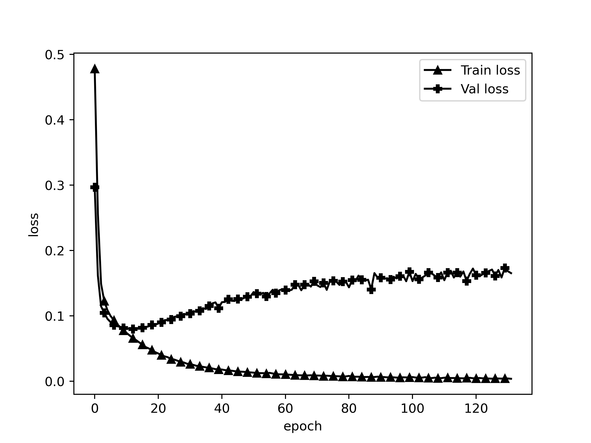

# ALBERT CCKS2019医渡云4k电子病历数据集命名实体识别

## Dataset

CHIP-2020-2中文医学文本实体关系抽取数据集，数据集包含儿科训练语料和百种常见疾病训练语料，儿科训练语料来源于518种儿科疾病，百种常见疾病训练语料来源于109种常见疾病。近7.5万三元组数据，2.8万疾病语句和53种定义好的schema。

同时相比于医学教材，临床实践文本指代关系明显，往往一段话中不会直接提及该主题疾病，因此针对临床实践类语料进行预处理，设计规则在每句之前增加主题疾病实体，并以@和原文分割。抽取语料时，如果三元组来源于上下多个句子，此时将句子进行拼接，”spo_list”中的Combined字段记录拼接信息。若句子中存在多个三元组，则记录在”spo_list”字段中，”text”字段记录来源文本。

数据原始格式形如：

### 数据集格式

```
{
   "spo_list" : [
      {
         "Combined" : true,
         "object" : {
            "@value" : "外照射"
         },
         "object_type" : {
            "@value" : "其他治疗"
         },
         "predicate" : "放射治疗",
         "subject" : "慢性胰腺炎",
         "subject_type" : "疾病"
      },
      {
         "Combined" : true,
         "object" : {
            "@value" : "外照射"
         },
         "object_type" : {
            "@value" : "其他治疗"
         },
         "predicate" : "放射治疗",
         "subject" : "非肿瘤性疼痛",
         "subject_type" : "疾病"
      }
   ],
   "text" : "慢性胰腺炎@### 低剂量放射 自1964年起，有几项病例系列报道称外照射 (5-50Gy) 可以有效改善慢性胰腺炎患者的疼痛症状。慢性胰腺炎@从概念上讲，外照射可以起到抗炎和止痛作用，并且已经开始被用于非肿瘤性疼痛的治疗。"
}
```

本代码需要将数据处理成如下的格式：

```
{
   "spo_list" : [
      {
         "Combined" : true,
         "object" : "外照射",
         "object_type" : "其他治疗",
         "predicate" : "放射治疗",
         "subject" : "慢性胰腺炎",
         "subject_type" : "疾病"
      },
      {
         "Combined" : true,
         "object" : "外照射",
         "object_type" : "其他治疗",
         "predicate" : "放射治疗",
         "subject" : "非肿瘤性疼痛",
         "subject_type" : "疾病"
      }
   ],
   "text" : "慢性胰腺炎@### 低剂量放射 自1964年起，有几项病例系列报道称外照射 (5-50Gy) 可以有效改善慢性胰腺炎患者的疼痛症状。慢性胰腺炎@从概念上讲，外照射可以起到抗炎和止痛作用，并且已经开始被用于非肿瘤性疼痛的治疗。"
}
```

### schemas格式

数据集中schemas的原始格式如下：


schemas需被处理成如下格式：

```
... ...

{"subject_type": "疾病", "predicate": "发病部位", "object_type": "部位"}
{"subject_type": "疾病", "predicate": "转移部位", "object_type": "部位"}
{"subject_type": "疾病", "predicate": "外侵部位", "object_type": "部位"}

... ...

```

### dataloader单条格式

`{'text': text, 'spo_list': [(s, p, o)]}`

ATTENTION:

- **`schema`中的`predicate`不能重复，如有重复要更改，加以区别，否则就算`object_type`和`subject_type`不一致，只要`predicate`一致，就认为是一个关系。数据里的`predicate`也要同步更改。**

## Project Structure

```
./
├── README.md
├── model.py                               CasRel模型
├── chinese_roformer-sim-char-ft_L-12_H-768_A-12                              786隐藏层base版bert模型
│   ├── bert_config.json
│   ├── bert_model.ckpt.data-00000-of-00001
│   ├── bert_model.ckpt.index
│   ├── bert_model.ckpt.meta
│   ├── checkpoint
│   └── vocab.txt
├── chinese_roformer-sim-char-ft_L-6_H-384_A-6                              384隐藏层base版bert模型
│   ├── bert_config.json
│   ├── bert_model.ckpt.data-00000-of-00001
│   ├── bert_model.ckpt.index
│   ├── bert_model.ckpt.meta
│   ├── checkpoint
│   └── vocab.txt
├── config.py                              模型配置
├── data                                   数据文件夹
│   ├── chip_2020_2                        原始数据
│   │   ├── 53_schemas.json
│   │   ├── train_data.json
│   │   └── val_data.json
│   ├── pred                               评估模型时预测生成的数据
│   │   └── val_pred_ep121.json
│   └── preprocessed                       经过处理后可以用预训练的数据
│       ├── 53_schemas.json
│       ├── train_data.json
│       └── val_data.json
├── dataloader.py                          训练数据生成器
├── evaluate.py                            评估方法
├── images
│   ├── model.png                          模型可视化
│   ├── train_loss.png                     训练损失
│   └── val_f1.png                         验证F1
├── schemaloader.py                        载入schema
├── log
│   ├── nohup.out                    训练日志
│   └── train_log.csv                训练损失
├── path.py                                项目所有文件的路径
├── plot.py                                画图工具
├── predict.py                             生成预测
├── report
│   └── f1.csv                             验证F1
├── statistics.py                          统计最长句子长度
├── train.py                               训练
├── utils                                  bert4keras工具包，也可pip下载
│   ├── __init__.py
│   ├── adversarial.py
│   ├── backend.py
│   ├── layers.py
│   ├── models.py
│   ├── optimizers.py
│   ├── snippets.py
│   └── tokenizers.py
└── weights                                保存的权重
    └── gplinker_roformer_best.h5

```

## Requirements

```
Keras==2.2.4
matplotlib==3.4.0
pandas==1.2.3
pydot==1.4.1
tensorflow==1.14.0
tqdm==4.61.2
```

## Steps

1. 将数据转换成规定格式
2. 修改path.py中的地址
3. 根据需要修改model.py模型结构
4. 调整超参数
5. fit前debug
6. 训练

## Model

### 预训练模型

> RoFormer-Sim，又称SimBERTv2，是SimBERT模型的升级版。
> 
> [https://github.com/ZhuiyiTechnology/roformer-sim](https://github.com/ZhuiyiTechnology/roformer-sim)
> 
> 基于UniLM思想、融检索与生成于一体的BERT模型。
> 
> 权重下载：[https://github.com/ZhuiyiTechnology/pretrained-models](https://github.com/ZhuiyiTechnology/pretrained-models)

### 三元组抽取下游模型

> [GlobalPointer：用统一的方式处理嵌套和非嵌套NER](https://spaces.ac.cn/archives/8373)
> 
> [Efficient GlobalPointer：少点参数，多点效果](https://spaces.ac.cn/archives/8877)
> 
> [GPLinker：基于GlobalPointer的实体关系联合抽取](https://spaces.ac.cn/archives/8888)

## Config

- `maxlen` 训练中每个batch的最大单句长度，少于填充，多于截断
- `epochs` 最大训练轮次
- `batch_size` batch size
- `model_type` 模型， 'roformer'

## Train

```
Epoch 1/200
2022-02-15 12:04:07.033710: I tensorflow/stream_executor/platform/default/dso_loader.cc:42] Successfully opened dynamic library libcublas.so.10.0
225/225 [==============================] - 227s 1s/step - loss: 112.4597 - global_pointer_1_loss: 13.2782 - global_pointer_2_loss: 49.8768 - global_pointer_3_loss: 49.3047
f1: 0.00000, precision: 1.00000, recall: 0.00000: : 3585it [01:16, 46.79it/s]
best f1: 0.00000

Epoch 2/200
225/225 [==============================] - 218s 969ms/step - loss: 29.6088 - global_pointer_1_loss: 6.5737 - global_pointer_2_loss: 11.5964 - global_pointer_3_loss: 11.4388
f1: 0.00000, precision: 1.00000, recall: 0.00000: : 3585it [01:13, 48.56it/s]
best f1: 0.00000

Epoch 3/200
225/225 [==============================] - 221s 984ms/step - loss: 22.2729 - global_pointer_1_loss: 5.5311 - global_pointer_2_loss: 8.4583 - global_pointer_3_loss: 8.2836
f1: 0.00000, precision: 1.00000, recall: 0.00000: : 3585it [01:15, 47.57it/s]
best f1: 0.00000

Epoch 4/200
225/225 [==============================] - 222s 986ms/step - loss: 19.4617 - global_pointer_1_loss: 5.0280 - global_pointer_2_loss: 7.2974 - global_pointer_3_loss: 7.1363
f1: 0.00000, precision: 1.00000, recall: 0.00000: : 3585it [01:14, 47.91it/s]
best f1: 0.00000

Epoch 5/200
225/225 [==============================] - 223s 990ms/step - loss: 17.7338 - global_pointer_1_loss: 4.7220 - global_pointer_2_loss: 6.5951 - global_pointer_3_loss: 6.4167
f1: 0.06133, precision: 0.89390, recall: 0.03175: : 3585it [01:15, 47.37it/s]
best f1: 0.06133

Epoch 6/200
225/225 [==============================] - 221s 980ms/step - loss: 16.3689 - global_pointer_1_loss: 4.4224 - global_pointer_2_loss: 6.0536 - global_pointer_3_loss: 5.8929
f1: 0.22094, precision: 0.75288, recall: 0.12946: : 3585it [01:15, 47.63it/s]
best f1: 0.22094

... ...

Epoch 78/200
225/225 [==============================] - 216s 962ms/step - loss: 1.2465 - global_pointer_1_loss: 0.3383 - global_pointer_2_loss: 0.4568 - global_pointer_3_loss: 0.4514
f1: 0.60697, precision: 0.67054, recall: 0.55441: : 3585it [01:16, 46.75it/s]
Early stop count 5/10
best f1: 0.60968

Epoch 79/200
225/225 [==============================] - 217s 965ms/step - loss: 1.3136 - global_pointer_1_loss: 0.3428 - global_pointer_2_loss: 0.4829 - global_pointer_3_loss: 0.4879
f1: 0.60727, precision: 0.67196, recall: 0.55394: : 3585it [01:16, 46.75it/s]
Early stop count 6/10
best f1: 0.60968

Epoch 80/200
225/225 [==============================] - 219s 973ms/step - loss: 1.1557 - global_pointer_1_loss: 0.2991 - global_pointer_2_loss: 0.4348 - global_pointer_3_loss: 0.4218
f1: 0.60797, precision: 0.67506, recall: 0.55300: : 3585it [01:15, 47.41it/s]
Early stop count 7/10
best f1: 0.60968

Epoch 81/200
225/225 [==============================] - 222s 985ms/step - loss: 1.5779 - global_pointer_1_loss: 0.4730 - global_pointer_2_loss: 0.5532 - global_pointer_3_loss: 0.5518
f1: 0.60758, precision: 0.67425, recall: 0.55291: : 3585it [01:14, 48.06it/s]
Early stop count 8/10
best f1: 0.60968

Epoch 82/200
225/225 [==============================] - 218s 970ms/step - loss: 1.2326 - global_pointer_1_loss: 0.3434 - global_pointer_2_loss: 0.4547 - global_pointer_3_loss: 0.4345
f1: 0.60693, precision: 0.67348, recall: 0.55234: : 3585it [01:15, 47.18it/s]
Early stop count 9/10
best f1: 0.60968

Epoch 83/200
225/225 [==============================] - 220s 979ms/step - loss: 1.2718 - global_pointer_1_loss: 0.3572 - global_pointer_2_loss: 0.4667 - global_pointer_3_loss: 0.4479
f1: 0.60525, precision: 0.67103, recall: 0.55121: : 3585it [01:16, 46.57it/s]
Early stop count 10/10
Epoch 00082: early stopping THR
best f1: 0.60968
```

验证集crf loss



预测时将生成验证集验证结果，在`data/pred/val_pred_ep{}.json`中。格式形如：

```json
{
    "text": "缺血性卒中@一些专门的卒中治疗中心使用MRI取代CT作为初始的首选影像学检查。",
    "spo_list": [
        [
            "缺血性卒中",
            "影像学检查",
            "MRI"
        ]
    ],
    "spo_list_pred": [
        [
            "缺血性卒中",
            "影像学检查",
            "MRI取代CT"
        ],
        [
            "缺血性卒中",
            "影像学检查",
            "MRI"
        ]
    ],
    "new": [
        [
            "缺血性卒中",
            "影像学检查",
            "MRI取代CT"
        ]
    ],
    "lack": []
}
```

其中，new为`spo_list_pred`中比`spo_list`中多出的关系/实体，lack为`spo_list_pred`中比`spo_list`中少的关系/实体

## Evaluate

在训练过程中使用Keras的Callback进行评估，评估策略为计算F1值，只有subject、predicate、object三者完全一致才算True。

根据总的F1来决定什么时候停止训练。即所有的predicate类别一起统计，TP为所有subject、predicate、object都正确的个数，TP+FP为预测实体总数，TP+FN为真实实体总数。

停止条件：当验证集F1超过10轮没有上升时，停止训练。

### 评估每个关系类别的F1

训练完成后选择最佳模型，直接运行`evaluate.py`

```python
result = evaluate_each_relations_f1(model_path = "./weights/gplinker_roformer_best.h5",
                                    dataset_path = "./data/chip2020/val_data.json")
df = pd.DataFrame(result)
df = df.T
df[["TP", "TP+FP", "TP+FN"]] = df[["TP", "TP+FP", "TP+FN"]].astype(int)
print(df)
```

- `model_path`: 模型地址
- `dataset_path`: 数据集地址

## Performance

### 验证集F1表现


### 验证集最佳F1

```
Epoch 73/200
225/225 [==============================] - 219s 973ms/step - loss: 1.4517 - global_pointer_1_loss: 0.4217 - global_pointer_2_loss: 0.5128 - global_pointer_3_loss: 0.5173
f1: 0.60968, precision: 0.67510, recall: 0.55583: : 3585it [01:16, 46.82it/s]
best f1: 0.60968
```

### 最佳模型每个关系的F1

```
Evaluating F1 of each Categories: 100%|███████████████████████| 3585/3585 [1:00:05<00:00,  1.01s/it]
                  TP  TP+FP  TP+FN  precision  recall      f1
预防                29     60     78     0.4833  0.3718  0.4203
阶段                20     30     44     0.6667  0.4545  0.5405
就诊科室               2      3      4     0.6667  0.5000  0.5714
同义词（其他/其他）         0      0      0     1.0000  1.0000  1.0000
辅助治疗             164    295    382     0.5559  0.4293  0.4845
化疗                19     24     34     0.7917  0.5588  0.6552
放射治疗               8     17     30     0.4706  0.2667  0.3404
同义词（其他治疗/其他治疗）     2      5     10     0.4000  0.2000  0.2667
手术治疗              85    142    196     0.5986  0.4337  0.5030
同义词（手术治疗/手术治疗）     1      6      2     0.1667  0.5000  0.2500
实验室检查            253    445    447     0.5685  0.5660  0.5673
影像学检查            189    306    317     0.6176  0.5962  0.6067
辅助检查              42    104    130     0.4038  0.3231  0.3590
组织学检查             39     58     91     0.6724  0.4286  0.5235
同义词（检查/检查）        32     57     69     0.5614  0.4638  0.5079
内窥镜检查             20     35     41     0.5714  0.4878  0.5263
筛查                 9      9     37     1.0000  0.2432  0.3913
多发群体              83    103    145     0.8058  0.5724  0.6694
发病率               46     76     86     0.6053  0.5349  0.5679
发病年龄              35     46     58     0.7609  0.6034  0.6731
多发地区              25     30     35     0.8333  0.7143  0.7692
发病性别倾向            18     25     35     0.7200  0.5143  0.6000
死亡率               10     13     16     0.7692  0.6250  0.6897
多发季节              13     16     15     0.8125  0.8667  0.8387
传播途径               3      6     12     0.5000  0.2500  0.3333
同义词（流行病学/流行病学）     0      0      2     1.0000  0.0000  0.0000
同义词（疾病/疾病）       478    562    582     0.8505  0.8213  0.8357
并发症              276    400    540     0.6900  0.5111  0.5872
病理分型             264    360    497     0.7333  0.5312  0.6161
相关（导致）            90    130    315     0.6923  0.2857  0.4045
鉴别诊断             184    230    290     0.8000  0.6345  0.7077
相关（转化）            33     64    165     0.5156  0.2000  0.2882
相关（症状）            34     49     74     0.6939  0.4595  0.5528
临床表现            1877   2743   3001     0.6843  0.6255  0.6536
治疗后症状              3      6     25     0.5000  0.1200  0.1935
侵及周围组织转移的症状        0      1     12     0.0000  0.0000  0.0000
同义词（症状/症状）         0      1      7     0.0000  0.0000  0.0000
病因               413    600    737     0.6883  0.5604  0.6178
高危因素             121    201    272     0.6020  0.4449  0.5116
风险评估因素            39     63    122     0.6190  0.3197  0.4216
病史                12     16     36     0.7500  0.3333  0.4615
遗传因素              10     10     23     1.0000  0.4348  0.6061
同义词（社会学/社会学）      17     26     36     0.6538  0.4722  0.5484
发病机制               1      1      6     1.0000  0.1667  0.2857
病理生理               6      6     12     1.0000  0.5000  0.6667
药物治疗             673   1015   1043     0.6631  0.6453  0.6540
同义词（药物/药物）        24     50     39     0.4800  0.6154  0.5393
发病部位             160    236    304     0.6780  0.5263  0.5926
转移部位              15     25     49     0.6000  0.3061  0.4054
外侵部位               8     12     31     0.6667  0.2581  0.3721
同义词（部位/部位）         0      0      1     1.0000  0.0000  0.0000
预后状况               5     17     47     0.2941  0.1064  0.1563
预后生存率              3      3     31     1.0000  0.0968  0.1765
```

## Predict

```python
text = "妊娠胆汁淤积@[HELLP 综合征] ### 急性妊娠期脂肪肝 体征/症状 检查 体征/症状 患者感觉不适，常见表现为全身乏力、恶心，很多具有先兆子痫、凝血功能异常和肾脏损伤的典型症状。妊娠胆汁淤积@肝脏活检见脂肪浸润，但一般诊断过程中极少进行活检。妊娠胆汁淤积@[HELLP 综合征] ### 急性妊娠期脂肪肝 体征/症状 检查 体征/症状 患者感觉不适，常见表现为全身乏力、恶心，很多具有先兆子痫、凝血功能异常和肾脏损伤的典型症状。妊娠胆汁淤积@肝脏活检见脂肪浸润，但一般诊断过程中极少进行活检。"
print(json.dumps(predict(text = text,
                         model_path = "./weights/gplinker_roformer_best.h5"), ensure_ascii = False))
```

`text`为输入文本，`model_path`为使用权重的路径

输出结果

```json
{
   "spo_list" : [
      {
         "object" : "维生素B12和（或）叶酸缺乏",
         "object_type" : "社会学",
         "predicate" : "病因",
         "subject" : "营养性巨幼细胞性贫血",
         "subject_type" : "疾病"
      },
      {
         "object" : "亚叶酸钙",
         "object_type" : "药物",
         "predicate" : "药物治疗",
         "subject" : "营养性巨幼细胞性贫血",
         "subject_type" : "疾病"
      },
      {
         "object" : "calc leucovorin",
         "object_type" : "药物",
         "predicate" : "同义词（药物/药物）",
         "subject" : "亚叶酸钙",
         "subject_type" : "药物"
      },
      {
         "object" : "抗叶酸代谢药物",
         "object_type" : "社会学",
         "predicate" : "病因",
         "subject" : "营养性巨幼细胞性贫血",
         "subject_type" : "疾病"
      },
      {
         "object" : "nutritional megaloblastic anemia",
         "object_type" : "疾病",
         "predicate" : "同义词（疾病/疾病）",
         "subject" : "营养性巨幼细胞性贫血",
         "subject_type" : "疾病"
      }
   ],
   "standarlization_list" : [
      {
         "attributes" : {
            "同义词（疾病/疾病）" : [ "nutritional megaloblastic anemia" ],
            "病因" : [ "维生素B12和（或）叶酸缺乏", "抗叶酸代谢药物" ],
            "药物治疗" : [ "亚叶酸钙" ]
         },
         "subject" : "营养性巨幼细胞性贫血"
      },
      {
         "attributes" : {
            "同义词（药物/药物）" : [ "calc leucovorin" ]
         },
         "subject" : "亚叶酸钙"
      }
   ],
   "text" : "营养性巨幼细胞性贫血（nutritional megaloblastic anemia)是由于维生素B12和（或）叶酸缺乏所致的一种大细胞性贫血。因使用抗叶酸代谢药物而致病者，可用亚叶酸钙（calc leucovorin)治疗。"
}
```

其中：

- `spo_list`为原始格式，抽出每个关系的列表
- `standarlization_list`为根据`spo_list`的父子关系结构化而成的json，subjects为父节点，objects为`attributes`列表里每个的value，objects_type为key

## 训练配置

```
                 ..                    bureaux@localhost.localdomain
               .PLTJ.                  -----------------------------
              <><><><>                 OS: CentOS Linux 7 (Core) x86_64
     KKSSV' 4KKK LJ KKKL.'VSSKK        Host: 2288 V5 Purley
     KKV' 4KKKKK LJ KKKKAL 'VKK        Kernel: 3.10.0-957.el7.x86_64
     V' ' 'VKKKK LJ KKKKV' ' 'V        Uptime: 117 days, 9 hours, 14 mins
     .4MA.' 'VKK LJ KKV' '.4Mb.        Packages: 1550 (rpm)
   . KKKKKA.' 'V LJ V' '.4KKKKK .      Shell: zsh 5.0.2
 .4D KKKKKKKA.'' LJ ''.4KKKKKKK FA.    Terminal: /dev/pts/1
<QDD ++++++++++++  ++++++++++++ GFD>   CPU: Intel Xeon Silver 4214R (48) @ 2.401GHz
 'VD KKKKKKKK'.. LJ ..'KKKKKKKK FV     GPU: Intelligent Management system chip w/VGA support]
   ' VKKKKK'. .4 LJ K. .'KKKKKV '      GPU: NVIDIA 3b:00.0 NVIDIA Corporation Device 1df6
      'VK'. .4KK LJ KKA. .'KV'         Memory: 80216MiB / 128273MiB
     A. . .4KKKK LJ KKKKA. . .4
     KKA. 'KKKKK LJ KKKKK' .4KK
     KKSSA. VKKK LJ KKKV .4SSKK
              <><><><>
               'MKKM'
                 ''
```